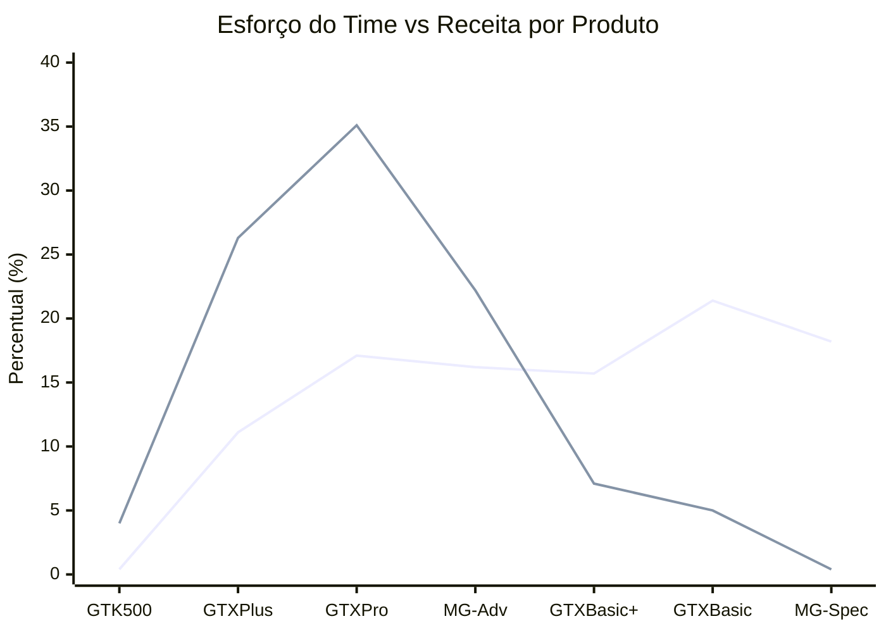
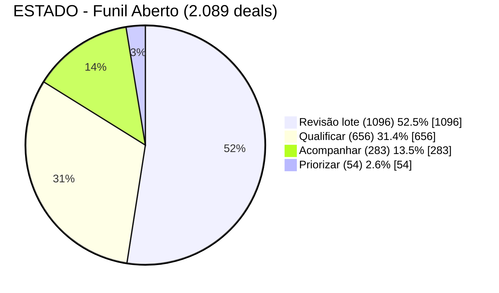

# Submissão — Gabriel Moreira — Challenge 003 (Lead Scorer)

## Sobre mim

- **Nome:** Gabriel Moreira
- **LinkedIn:** [linkedin.com/in/gmoreirasantos](https://www.linkedin.com/in/gmoreirasantos/)
- **E-mail:** gmoreira1santos@gmail.com
- **Challenge escolhido:** 003 — Lead Scorer (Vendas / RevOps)

---

## Executive Summary

Antes de propor qualquer score, testei se o cadastro sustenta uma previsão de conversão (qui-quadrado, Mann-Whitney, AUC com holdout temporal, testes de permutação) sobre os 6.711 negócios com desfecho registrado: **nenhum atributo firmográfico prevê ganho ou perda** — produto, setor, conta e vendedor igualmente (AUC 0,475–0,523 isolada, 0,500 combinada; permutação p entre 0,262 e 0,965; ver [docs/report.md §1, §2 e §12](./docs/report.md) e, para o que esses p-valores autorizam afirmar — e para os dois números de versões anteriores que não valem mais —, [analise-lead-scoring.md §1.1.2](./docs/analise-lead-scoring.md)). O encolhimento hierárquico diz o mesmo de outra forma: os três níveis abaixo do global colapsam, e `p̂` vale 0,632 para os sete produtos. Esses testes autorizam menos do que parecem: "não rejeitou" não é "os vendedores são iguais", e a §14 mede onde fica a fronteira — os 15,42pp entre o melhor e o pior vendedor são o que 30 carteiras deste tamanho já produzem por acaso (mediana nula 14,38pp), mas a dispersão verdadeira estimada por variância em excesso é **τ̂ = 1,08pp**, positiva, e o menor efeito que este histórico detectaria com 80% de poder é **τ = 3,04pp**. A diferença plausível entre vendedores cai inteira na zona cega do teste: pequena demais para entrar no score, grande demais em receita para ser declarada inexistente — medi-la exige alocação aleatorizada de leads comparáveis ([roadmap §3](./docs/roadmap.md)), não este histórico observacional. O **fit por vendedor** existe como camada operacional separada — sugestão de redistribuição de sobrecarga —, nunca em `p̂`/SCORE, e sempre com a ressalva acoplada ao número. A ferramenta não classifica probabilidade de conversão — ela ordena o funil por **valor em risco**: `SCORE = percentil(p̂ × VALOR × URGÊNCIA)`, acompanhado de `CONFIANÇA` (quanto o número está apoiado em dado real) e `ESTADO` (a ação recomendada), com `p̂` calibrado por encolhimento hierárquico (`k` derivado dos dados, sem constantes congeladas). Entreguei uma API FastAPI + frontend React rodando de ponta a ponta — priorização, filtros, revisão em lote, exportação CSV e alerta de sobrecarga por vendedor com sugestão de redistribuição —, tudo validado por um backtest reprodutível (`make validate`) que também documenta três tentativas de deixar o modelo mais granular que **pioraram** a previsão fora da amostra e foram descartadas, não escondidas.

---

## Solução

### Abordagem

Comecei pela pergunta que a maioria dos guias de lead scoring pula: **os dados sustentam um score de probabilidade de conversão?** Rodei testes estatísticos (qui-quadrado, Mann-Whitney, AUC de modelos preditivos com holdout temporal, testes de permutação) sobre os 6.711 negócios com desfecho registrado — a resposta foi não para todos os atributos firmográficos, vendedor incluído (permutação p entre 0,262 e 0,965; detalhe em [docs/report.md §1, §2 e §12](./docs/report.md)). Só depois desenhei a alternativa que os dados sustentam: um score de **valor em risco**, calibrado com encolhimento hierárquico (empirical Bayes) e curvas de aging isotônicas.

O trabalho seguiu em ciclos de decisão → implementação → validação → correção:
1. Análise exploratória completa, documentada em [docs/analise-lead-scoring.md](./docs/analise-lead-scoring.md)
2. Sessão de "grilling" (perguntas estruturadas) para validar cada decisão contra os dados
3. Implementação via OpenSpec (proposta → specs → tasks → código)
4. Análise de carga e fit por vendedor, com sugestão informativa de redistribuição ([docs/architecture.md §Carga e fit por vendedor](./docs/architecture.md))

### Resultados / Findings

**A fórmula final:**

```
p̂          = p̂(produto, idade)                                            [encolhimento hierárquico, k derivado dos dados; setor NÃO entra — ver docs/analise-lead-scoring.md §3.4]
PRIORIDADE = p̂ × VALOR(produto, porte) × URGÊNCIA(idade)                   [dólares, auditável — não exibido]
SCORE      = percentil(PRIORIDADE vs. os 4.238 negócios historicamente ganhos) × 100
CONFIANÇA  = min(completude, suporte)                                      [0-100]
ESTADO     = árvore(sem_precedente, SCORE≥95, CONFIANÇA<50)
```

Derivação completa de cada termo em [docs/analise-lead-scoring.md](./docs/analise-lead-scoring.md). Como cada peça se conecta (API, frontend, validação) em [docs/architecture.md](./docs/architecture.md). Validação em [docs/report.md](./docs/report.md).

**Onde está a receita, contra onde está o esforço do time** — a distorção mais cara encontrada na análise:



MG Special + GTX Basic somam **39,6% dos negócios e do esforço do time, para 5,4% da receita** — e MG Special tem a *maior* taxa de conversão da carteira (65%), a armadilha exata que um score de probabilidade de conversão premiaria. Detalhe em [docs/analise-lead-scoring.md §1.2 "Valor é altamente previsível"](./docs/analise-lead-scoring.md).

**Como o funil aberto (2.089 oportunidades — todas as que o CRM registra em aberto) se distribui pela recomendação de ação:**



_Fila trabalhável: 993 oportunidades (Qualificar + Acompanhar + Priorizar)_

`Revisão em lote` (sem precedente histórico de fechamento) fica fora da fila ordenada de trabalho — não é "negócio perdido", é passivo de higiene de dados a resolver em lote com o gestor. A fila trabalhável tem 993 oportunidades.

Metade do funil cair em `Revisão em lote` é o dado dizendo a verdade, não a ferramenta falhando: 653 dessas oportunidades estão abertas há 200 dias ou mais — algumas há 423 — muito além do ciclo mais longo já observado (138 dias). O sistema não converte nenhuma delas em perda; ele as mostra, com a ressalva de que não há precedente histórico para pontuá-las, e deixa a decisão com quem tem contexto.

**Sobrecarga de vendedor e sugestão automatizada de redistribuição:**

Além de priorizar cada oportunidade, a ferramenta compara a carteira de cada vendedor com a média do próprio escritório regional em cada ESTADO, e marca como **sobrecarregado** o par (vendedor, ESTADO) que atende simultaneamente `contagem ≥ 1,5× a média do escritório` **e** `contagem ≥ 5` (piso absoluto — sem ele, um vendedor com 1 oportunidade num ESTADO raro apareceria como "10× a média" por puro ruído de amostra pequena). Sobre o funil atual: **12 pares sobrecarregados, 8 vendedores, 227 oportunidades**.

Para cada oportunidade de vendedor sobrecarregado, o sistema sugere um colega **do mesmo escritório**, não sobrecarregado naquele ESTADO, com histórico de negócios fechados — combinando folga de carga com o fit histórico do candidato no produto e no setor da oportunidade (`rank = 0,5×folga + 0,5×fit`, produto pesando 0,6 e setor 0,4). Quando não existe candidato elegível, o sistema reporta isso explicitamente em vez de forçar uma sugestão. **A sugestão é só informativa: nunca reatribui a oportunidade nem altera o dono registrado** — quem decide continua sendo o gestor.

O vendedor sugerido só aparece na aba **Sobrecarga** e no painel de detalhe da oportunidade — a listagem geral de Oportunidades recebe apenas um booleano `sobrecarregado`, nunca o nome do candidato. Detalhe técnico completo (fórmulas, encolhimento, endpoints) em [docs/architecture.md §Carga e fit por vendedor](./docs/architecture.md) — a spec formal via OpenSpec (proposta → design → specs) guiou a implementação, mas `openspec/` é gerado localmente e não faz parte deste checkout (ver `.gitignore`). Screenshots do fluxo em [process-log/screenshots/06-sobrecarga.png](./process-log/screenshots/06-sobrecarga.png) e [06b-sobrecarga-detalhe.png](./process-log/screenshots/06b-sobrecarga-detalhe.png).

**Validação:** `make validate` reproduz, em 14 seções, os achados estruturais (ausência de sinal em produto/setor/conta/vendedor, colapso do encolhimento hierárquico nos três níveis, monotonicidade das curvas de aging, concentração de valor no topo da fila, ausência de desfecho atribuído na calibração, fit por vendedor, e o poder dos próprios testes de vendedor — o menor efeito que a amostra enxergaria) e testa por validação cruzada três hipóteses de tornar o modelo mais granular — as três pioraram a previsão fora da amostra e foram descartadas, não escondidas. Saída completa comentada em [docs/report.md](./docs/report.md).

### Recomendações

1. **Realocar capacidade de MG Special/GTX Basic** para autosserviço ou um time de menor custo — libera ~14 vendedores-equivalentes para produtos que rendem de 10× a 400× mais por dia de esforço.
2. **Instrumentar dado comportamental** (timestamp de mudança de etapa, speed-to-lead, motivo de perda estruturado) — é a lacuna que explica a AUC próxima de 0,50 em produto/setor/conta e o próximo passo de maior retorno. Lista priorizada em [docs/analise-lead-scoring.md §6 "O que não foi implementado"](./docs/analise-lead-scoring.md).
3. Roadmap completo, com esforço e impacto estimados por item, em [docs/roadmap.md](./docs/roadmap.md) — inclui um job de monitoramento de notícias de conta como próximo passo de sinal externo.

### Limitações

- **Sem autenticação** — decisão consciente para um dataset público de demonstração; produção exigiria SSO/OIDC real com escopo por papel.
- **`p̂` varia só entre 0,63 e 0,75** — a ferramenta não prevê quem vai fechar, prioriza por valor e urgência. Isso é o achado central, não um bug a corrigir.
- **Sem persistência** — tudo em memória, recarregado a cada execução; CSV exportado é o artefato durável hoje.
- **Sem sinal comportamental** — nenhum dos 4 CSVs de origem carrega e-mail aberto, ligação atendida, ou visita ao site.

Lista completa e caminho de evolução em [docs/architecture.md §Limitações conhecidas](./docs/architecture.md) e [docs/roadmap.md](./docs/roadmap.md).

---

## Process Log — Como usei IA

Ver narrativa completa e cronológica em [process-log/narrative.md](./process-log/narrative.md).
Log de decisões (registro completo, entrada por entrada) em [process-log/decisions-log.md](./process-log/decisions-log.md).

### Ferramentas usadas

| Ferramenta | Para que usou |
|------------|--------------|
| Claude Code | Análise exploratória dos dados (AUC, permutação, encolhimento hierárquico), sessões de "grilling" para stress-testar decisões de design, geração de proposta/specs via OpenSpec, implementação completa (backend, frontend, validação), redesenho de CONFIANÇA/ESTADO, saneamento de dados e análise de carga/fit por vendedor |
| Cursor | Revisão e ajustes pontuais no código já gerado pelo Claude Code (backend/frontend) |

### Workflow

1. Análise exploratória sobre os CSVs brutos, corrigindo qualidade de dados antes de qualquer modelo (typos de setor, produto duplicado)
2. Sessão de perguntas estruturadas (32 perguntas, depois 33 numa segunda rodada) para forçar cada decisão de design contra evidência medida, não contra convenção — cada resposta validada com um script rodado nos dados reais, não estimada
3. Especificação formal via OpenSpec (proposta → design → specs testáveis → tasks) antes de qualquer código de produção
4. Implementação seguindo as tasks, com testes unitários e de contrato de API escritos junto
5. Verificação manual no navegador (não só testes automatizados) — dois bugs reais de UI foram achados dessa forma, não pelos testes
6. Dois ciclos de redesenho movidos por feedback de uso real (remoção de RBAC, redesenho de CONFIANÇA/ESTADO) e um ciclo de saneamento de dados movido pela própria recomendação da análise exploratória

Passo a passo detalhado, com data e o que foi decidido por mim vs. executado pela IA, em [process-log/narrative.md](./process-log/narrative.md).

### Onde a IA errou e como corrigi

- A primeira versão do redesenho de ESTADO fazia ESTADO derivar quase só de CONFIANÇA — eu apontei que eram dois eixos diferentes (quanto sei vs. o que fazer), e a IA corrigiu para uma árvore de decisão cruzando os dois.
- `constants.classificar_porte` só checava `employees is None`, mas o merge preenche ausência com `NaN` — `NaN < limiar` é sempre `False` em Python, então toda oportunidade sem conta caía silenciosamente em "Enterprise". Achado durante a implementação, não previsto no design; corrigido e a distribuição de ESTADO foi recalculada.
- `K_PRODUTO = 4` foi mantido como constante congelada numa calibração em que a recomputação estrita já mostrava colapso — a IA sinalizou a tensão em vez de esconder ou decidir sozinha; a decisão final (manter, depois remover em 2026-08-21 quando os dados mudaram e o nível de produto deixou de colapsar, substituindo por shrinkage derivado dos dados) foi minha, registrada em [process-log/decisions-log.md](./process-log/decisions-log.md).
- A IA tratou a diferença de win rate entre vendedor e setor/produto como estatisticamente fraca demais para importar — eu apontei que, em receita, qualquer acréscimo de conversão em escala pode fazer diferença brutal, mesmo quando o p-valor é limítrofe.

### O que eu adicionei que a IA sozinha não faria

- A pergunta inicial de matar a hipótese de probabilidade de conversão antes de aceitar a fórmula pronta — sem isso, o projeto teria implementado um classificador com AUC 0,50 sem perceber.
- Insistir em validar cada resposta de design contra um script rodando nos dados reais, não em aceitar a resposta mais plausível.
- Pedir a segunda rodada de "grilling" depois de ver o sistema em uso real — os problemas de UX (CONFIANÇA forçando "desistir" para 61,8% do funil) só ficaram óbvios rodando a ferramenta, não lendo a spec.
- A decisão de negócio de implementar `mult_setor` mesmo com o resultado de validação cruzada negativo — julgamento de produto, não um resultado que os dados sozinhos indicavam. E, em 2026-08-29, a decisão de **desfazê-la**: a validação nunca mudou de sinal, e manter um ajuste sobre a única dimensão que o próprio backtest testa e rejeita contradizia o critério aplicado a gerente, região e receita. A remoção não move nenhuma oportunidade de ESTADO nem o top 50 da fila (ver [decisions-log](./process-log/decisions-log.md), 2026-08-29).
- Um score de confiança sobre os dados, assim o time de vendas consegue analisar quais scores são realmente de qualidade.

---

## Evidências

- [x] Chat exports → [process-log/chat-exports/claude.md](./process-log/chat-exports/claude.md)
- [x] Git history (branch [`submission/gabriel-moreira`](https://github.com/ga987123/ai-master-challenge/tree/submission/gabriel-moreira))
- [x] Narrativa escrita → [process-log/narrative.md](./process-log/narrative.md)
- [x] Log de decisões → [process-log/decisions-log.md](./process-log/decisions-log.md)
- [x] Screenshots do produto e do workflow → [process-log/screenshots/](./process-log/screenshots/) (13 imagens: fluxo de oportunidades, filtros, revisão em lote, sobrecarga por vendedor, gestão/rollup, visão mobile)

---

_Submissão enviada em: 2026-08-21 (iniciada em 2026-08-18)_
_Submissão reenviada em: 2026-08-30_
