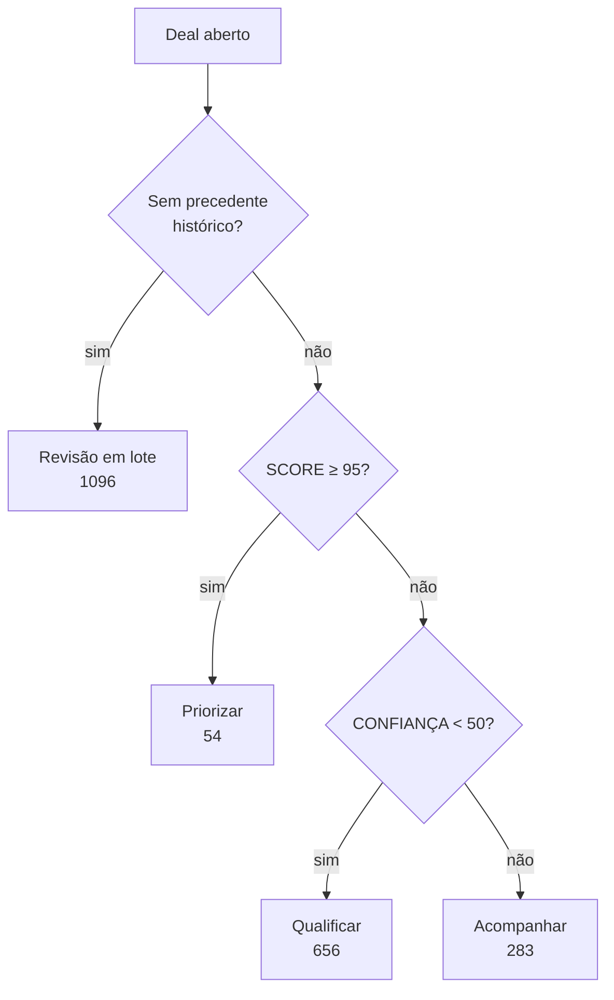
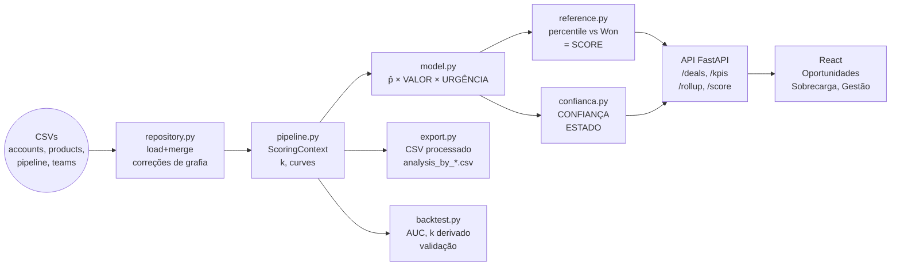

# Arquitetura da Solução

Blueprint técnico da implementação: como cada peça funciona e como é validada. Para a lógica das decisões que levaram a este desenho, ver [decisions-log.md](../process-log/decisions-log.md); para a derivação estatística por trás da fórmula, ver [analise-lead-scoring.md](./analise-lead-scoring.md).

---

## Visão geral

Ferramenta de triagem de pipeline por **valor em risco**, não por probabilidade de conversão categórica. A evidência: nos 6.711 negócios com desfecho registrado (out/2016–dez/2017), conta, setor, gerente, escritório **e vendedor** não preveem ganho/perda — AUC 0,475-0,523 isolada e 0,500 combinada, testes de permutação com p entre 0,262 e 0,965 (ver [docs/report.md](./report.md) §1, §2 e §12). O fit por vendedor existe como mecanismo separado de redistribuição de sobrecarga, nunca em `p̂`. A calibração hierárquica confirma a ausência de sinal de outra forma: os três níveis abaixo do global — conta×produto, produto×setor e produto — têm variância em excesso ≤ 0 e colapsam para peso zero automaticamente, de modo que `p̂_produto` vale 0,632 para os sete produtos.

O que diferencia uma oportunidade da outra é, sobretudo, **valor** (produtos de US$ 55 a US$ 26.768, 487×) e **tempo até a resolução** — não para quem se vende ou em que setor.

**A fórmula:**

```
PRIORIDADE = P̂ganho(produto, idade) × VALOR(produto, porte) × URGÊNCIA(idade)   [dólares, valor auditável]
SCORE      = percentil(PRIORIDADE contra os 4.238 negócios historicamente ganhos) × 100

CONFIANÇA  = min(completude, suporte)                                            [0-100]
  completude = % dos 5 campos de cadastro observados (engajamento, conta, funcionários, setor, time)
  suporte    = (0,65 × precedente_na_idade + 0,20 × volume_do_produto) / 0,85, cada termo saturando em n/50
```

**SCORE é o único número de prioridade exposto** — não PRIORIDADE em dólares, que permanece calculada e exportada no CSV como valor intermediário auditável, mas não aparece na tela nem ordena a fila (o porquê está em §Explicabilidade e plano de ação). CONFIANÇA e SCORE nunca se combinam num único número: CONFIANÇA mede quanto do necessário para pontuar está de fato observado; SCORE mede quanto a oportunidade vale agora. Um **ESTADO** deriva de uma árvore de decisão sobre os dois e vira a etiqueta de ação que o vendedor vê: **Priorizar, Acompanhar, Qualificar, Revisão em lote**.

**Toda oportunidade aberta recebe PRIORIDADE — inclusive as 1.425 sem conta e as 500 em Prospecting.** A ausência de conta custa no máximo 8% de VALOR (prior neutro de porte), nunca a viabilidade do score.

---

## Stack técnica

**Backend:**
- Python 3.10+
- FastAPI (REST API aberta — sem autenticação; listagem paginada, detalhe de oportunidade, rollup, `/score` para oportunidade avulsa)
- Pandas (ETL + data layer)

**Frontend:**
- React 18+
- TypeScript
- Recharts (visualizações)
- Tailwind CSS

**Data:**
- CSV loader (in-memory pandas), atrás de um módulo repositório
- 8.800 linhas × 4 tabelas (accounts, products, sales_pipeline, sales_teams)
- Exportação: CSV consolidado com o dataset processado + scores, regravado a cada carga

**Deployment:**
- Docker Compose (API + React bundled)
- Python deps pinned em requirements.txt
- React build output servido pelo mesmo container

**Validação:**
- Script Python standalone (importa `scoring/`) que roda:
  - Backtest out-of-time nos 6.711 negócios fechados (AUC por atributo firmográfico)
  - Permutation tests sobre agent/product/sector/account
  - Reprodução do cálculo de `k` hierárquico e do colapso de conta×produto/produto×setor
  - Verificação de monotonicidade de `risco(t)` e da fronteira de 138 dias
  - Concentração de PRIORIDADE (top 10%/30%) vs. ranking por preço puro

**Testes** (`make test`, em sequência):
- `scoring/` — 142 unitários: motor de scoring (encolhimento, curvas, censura, confiança, estado, plano de ação em passos, carga e fit)
- `api/` — 63 de contrato e e2e: endpoints sem autenticação, paginação (união de páginas sem repetição/lacuna, ordenação sobre o recorte inteiro, desempate estável), detalhe de oportunidade, opções de filtro, exportação de identificadores filtrados
- `validation/` — 23 de determinismo e consistência entre artefato, CSV e API
- `web/` — checagem de tipos (`tsc -b`)

---

## Dados

### Carregamento

```
accounts (85 linhas)
  + country / sector / employees / revenue / year_established

sales_pipeline (8.800 linhas)
  + opportunity_id / deal_stage / engage_date / close_date / close_value

products (7 itens)
  + product / sales_price

sales_teams (35 linhas)
  + sales_agent / manager / regional_office
  → hierarquia real: 35 agentes → 6 managers → 3 escritórios (Central/East/West)

MERGE:
  sales_pipeline
    LEFT JOIN accounts ON account
    LEFT JOIN products ON product
    LEFT JOIN sales_teams ON sales_agent
```

### Tratamentos de qualidade

| Problema | Correção |
|---|---|
| `technolgy` typo em sector | → `technology` |
| `GTXPro` vs `GTX Pro` | → normalizar para `GTX Pro` (1.147 negócios) |
| 1.425 deals abertos sem `account` | pontuáveis normalmente — VALOR usa prior neutro de porte (mult=1,00), completude de CONFIANÇA cai (faltam conta/funcionários/setor) |
| 500 Prospecting sem `engage_date` | pontuáveis normalmente — `p̂` = `p̂_produto` sem ajuste de idade, URGÊNCIA fixa em 0,47 |
| bimodal cycle (picos 0–19d e 60–90d) | motivou a leitura das curvas de aging como função em degraus, não decaimento contínuo |

---

## Lógica de scoring

### PRIORIDADE

```
p̂_produto = (n_produto × taxa_produto + k × 0,632) / (n_produto + k)    ← encolhimento hierárquico, k derivado em tempo de carga; o nível de produto colapsa (k = ∞), logo p̂_produto = 0,632 para os sete

  se Prospecting:      p̂(idade) = p̂_produto (sem ajuste de idade)
  se idade > 138:       p̂(idade) = 0,632                                 ← censura: reverte ao prior global
  senão:                p̂(idade) = p̂_produto × p_ganho(min(idade,120)) / 0,632

p̂ = p̂(idade)                                                            ← produto e idade são os únicos insumos; setor NÃO entra (ver abaixo)

VALOR = preço_tabela(produto) × mult_porte(porte, default 1,00)

  se Prospecting:      URGÊNCIA = 0,47
  se idade > 138:       URGÊNCIA = 0,15
  senão:                URGÊNCIA = risco_isotônico(min(idade,120))

PRIORIDADE = p̂ × VALOR × URGÊNCIA                                  ← em dólares, valor auditável
SCORE      = percentil(PRIORIDADE) × 100                           ← contra os 4.238 negócios historicamente ganhos
```

**SCORE não é relativo ao funil aberto corrente** — é o percentil de PRIORIDADE contra a distribuição de PRIORIDADE calculada sobre os 4.238 negócios historicamente **ganhos** (usando a idade real de cada um no fechamento). Essa referência é histórica e fixa; só muda no ciclo trimestral de recalibração.

`k` é derivado em tempo de carga: `k = variância_esperada_por_acaso / variância_em_excesso`, para os **quatro** níveis da hierarquia (conta×produto, produto×setor, produto, global) — nenhum usa constante congelada. Nos dados atuais, os três níveis abaixo do global têm variância em excesso ≤ 0 e colapsam (`k = ∞`), então `p̂_produto` vale 0,632 para os sete produtos.

**Achado que inverte a intuição comum de lead scoring:** `p_ganho(t)` **sobe** com a idade (0,632 aos 0 dias → 0,751 aos 120 dias) — não desce. O que a idade consome é a **janela**: em 57 dias, metade das vitórias históricas já aconteceu; em 88 dias, restam 25%. Por isso URGÊNCIA usa `risco(t)`, a probabilidade real de resolução em 30 dias (suavizada por regressão isotônica), não um proxy de "quão velho é ruim".

#### Cálculo detalhado de p̂

A probabilidade de ganho é calculada em **três casos**, de forma determinística:

**1. Prospecting (sem `engage_date`):**
```
p̂ = p̂_produto
```
Usa apenas a taxa de vitória do produto, com encolhimento hierárquico aplicado. Sem ajuste de idade porque não há idade a medir — o lead ainda nem entrou no funil de venda estruturado.

**2. Engaging, idade > 138 dias (censura):**
```
p̂ = 0,632  (constante — o prior global)
```
Nenhum dos 6.711 negócios fechados históricos levou mais de 138 dias. Acima disso, revertemos ao prior em vez de extrapolar a curva — evita premiar abandono, que teria `p̂ = 0,751` se forward-fillássemos.

**3. Engaging, idade ≤ 138 dias (dentro da janela observada):**
```
p̂ = p̂_produto × p_ganho(min(idade, 120)) / 0,632
```
Ajusta a taxa do produto pela curva de ganho empírica. Dividi-se por 0,632 para renormalizar — `p_ganho(t)` é calibrada em absoluto, não como multiplicador.

**Exemplo:**
- GTX Pro: 64,8% taxa de vitória histórica (p̂_produto = 0,648)
- Oportunidade em Engaging, 57 dias de idade
- p_ganho(57) = 0,684 (regressão isotônica nos dados)
- p̂ = 0,648 × 0,684 / 0,632 = 0,702

#### Cálculo detalhado de URGÊNCIA

URGÊNCIA mede `P(o negócio se resolve nos próximos 30 dias | ainda aberto)` — é a probabilidade real de fechamento próximo, não um decaimento inventado. Também em **três casos**:

**1. Prospecting:**
```
URGÊNCIA = 0,47  (constante observada)
```
Representa a velocidade média de resolução para leads que entram no funil sem uma oportunidade formalizada. Calibrada empiricamente na população histórica.

**2. Engaging, idade > 138 dias (censura):**
```
URGÊNCIA = 0,15  (baixa — praticamente sem precedente)
```
Negocios com mais de 138 dias já perderam a janela normal de fechamento. A urgência cai drasticamente porque estadisticamente já não deveria estar aberto.

**3. Engaging, idade ≤ 138 dias:**
```
URGÊNCIA = risco(idade)
```
Leitura em degraus (step function) da curva isotônica calibrada:

| Idade (dias) | risco(t) | Interpretação |
|---|---:|---|
| 0–44 | 0,219 | Recém-aberto; apenas 21,9% resolvem nos próximos 30 dias |
| 45–56 | 0,322 | Começou a acelerar |
| 57–87 | 0,489 | Metade do ciclo; ~49% resolvem em 30 dias |
| 88–109 | 0,832 | Bem avançado; 83% dos negócios resolvem em 30 dias |
| ≥110 | 1,000 | Última reta; praticamente certo que resolve ou fecha |

**Exemplo:** mesma GTX Pro com 57 dias:
```
risco(57) = 0,489
```
Significa que, entre negócios em Engaging com 57 dias de idade, 48,9% resolvem (ganham ou perdem) nos próximos 30 dias — a urgência de ação é moderada, não baixa nem crítica.

### Censura acima de 138 dias

Nenhum dos 6.711 negócios fechados levou mais de 138 dias. Acima disso, o sistema **não extrapola** a curva — reverte ao prior (`p̂` = 0,632, URGÊNCIA = 0,15) em vez de aplicar forward-fill, que premiaria o abandono (daria `p̂` = 0,751 a um negócio de 377 dias, o mais alto da curva, exatamente ao mais parado do funil).

### Setor fora de p̂

Setor **não entra em `p̂` em forma nenhuma** — nem como condicionamento direto, nem como multiplicador encolhido. Duas validações independentes, reproduzidas a cada execução do backtest, sustentam a exclusão:

| Evidência | Onde se reproduz | Resultado |
|---|---|---|
| Variância em excesso do nível produto×setor | `validation/shrinkage_check.py`, seção 3 do backtest | ≤ 0 → `k = ∞`, o nível colapsa (o encolhimento correto é `1,000`) |
| Validação cruzada 5-fold, fora da amostra | `validation/sector_conditioning_check.py`, seção 6 do backtest | condicionar por produto×setor tem logloss **pior** que não condicionar (0,66974 vs. 0,66795) |

É o mesmo critério que mantém gerente, região, receita e idade da empresa fora da fórmula. Não há constante de política em `p̂`: todo nível usa o `k` derivado dos dados.

**Onde setor continua sendo lido:** na completude de CONFIANÇA (é um dos cinco campos de cadastro), no fit vendedor×setor da sugestão de redistribuição de carga (mecanismo separado, nunca `p̂`/SCORE), no artefato `analysis_by_sector_detailed.csv` e como filtro/exibição na interface. O histórico da decisão está em [decisions-log.md](../process-log/decisions-log.md).

### CONFIANÇA — quanto se sabe sobre a oportunidade

CONFIANÇA responde: "**quanto do que este score afirma está apoiado em dado observado e em precedente histórico?**" — uma escala numérica 0-100, `min(completude, suporte)`. Idade não entra em CONFIANÇA diretamente, apenas no termo de suporte via densidade de precedente histórico.

#### completude — os cinco campos de cadastro

```
completude = 100 × (campos observados) / 5
campos: engage_date (estágio Engaging) · conta vinculada · funcionários da conta · setor · time atribuído
```

#### suporte — quanto histórico sustenta os números usados

```
s_idade   = min(1, negócios_ganhos_na_janela_de_±15_dias / 50)
s_produto = min(1, negócios_fechados_do_produto / 50)

suporte = 100 × Σ(peso_i × termo_i, termos presentes) / Σ(peso_i, termos presentes)
pesos: idade 0,65 · produto 0,20
```

`s_idade` é OMITIDO, nunca zerado, quando não há idade conhecida (Prospecting), e o peso restante é renormalizado. Com os dois termos presentes, a fórmula se reduz a `100 × (0,65×s_idade + 0,20×s_produto) / 0,85`; com só `s_produto` presente (Prospecting), reduz a `100 × s_produto`.

Suporte tem exatamente dois termos porque responde "quanto histórico sustenta os números **efetivamente usados**" — e `p̂` usa só produto e idade. A mediana de CONFIANÇA sobre o funil aberto é 23,5, monitorada na seção 9 de [report.md](./report.md).

`min`, não média: saber todos os campos de uma oportunidade sem precedente histórico não a torna confiável — a metade mais fraca governa. Omitir (não zerar) um termo ausente evita cobrar a mesma ausência duas vezes (já cobrada em completude) — sem essa correção, as 500 oportunidades em Prospecting, as mais novas do funil, caíam no mesmo tratamento das mais abandonadas.

**Marcador de ausência de precedente:** `sem_precedente = (s_idade == 0 com idade conhecida)` — nenhum negócio ganho fechou na faixa de idade desta oportunidade. É esse marcador, não um corte sobre CONFIANÇA, que decide o roteamento de ESTADO — porque oportunidades novas sem cadastro e oportunidades antigas sem precedente se aglomeram em valores adjacentes de CONFIANÇA (20 e 25), em ordem invertida: nenhum corte único separa as duas populações.

### ESTADO — árvore de decisão sobre SCORE e CONFIANÇA

```
1. sem precedente histórico   -> Revisão em lote
2. SCORE >= 95                -> Priorizar
3. CONFIANÇA < 50             -> Qualificar
4. caso contrário             -> Acompanhar
```



CONFIANÇA e ESTADO não são a mesma coisa: **CONFIANÇA é o quanto acreditar no score**; **ESTADO é a ação recomendada**. O roteamento é uma árvore, e não uma tabela cruzando faixas dos dois eixos, por duas razões: CONFIANÇA contínua em 0-100 não tem quebras naturais que sustentem faixas, e a ordem explícita da árvore deixa visível qual condição decidiu cada caso — em vez de esconder uma regra de mão única dentro de uma célula.

O corte de SCORE (95) é o percentil 95 da própria distribuição de referência — acompanha a recalibração trimestral sem constante própria. O corte de CONFIANÇA (50) significa "menos da metade do que este score afirma está apoiado em dado observado e precedente" — ambos ancorados, não ajustados por tentativa e erro.

São quatro estados, não cinco: "falta informação" e "falta maturidade" convergem para o mesmo plano de ação ("busque a informação que falta antes de tratar como prioridade"), e a distinção entre eles é exatamente o que a metade de completude já expõe como número — não precisa de um estado à parte.

| Estado | Ação |
|---|---|
| **Priorizar** | Contato esta semana — SCORE no percentil 95+ da distribuição histórica de vitórias |
| **Acompanhar** | Follow-up regular — nada falta saber e o valor ainda não justifica agir com urgência agora |
| **Qualificar** | Obter a informação específica que falta (nomeada pela razão de CONFIANÇA) antes de tratar como tarefa priorizada |
| **Revisão em lote** | Passivo de higiene de dados — sem precedente histórico de fechamento. Fora da fila ordenada de trabalho, tratado em lote com o gestor |

Distribuição sobre o funil aberto (2.089 oportunidades):

```
Priorizar           54
Acompanhar         283
Qualificar         656
Revisão em lote  1.096
Fila trabalhável   993
```

`Revisão em lote` contém as oportunidades sem precedente histórico de fechamento — todas em Engaging, idade de 154 a 423 dias, acima dos 138 observados. Nenhuma oportunidade em Prospecting cai nela, pois idade desconhecida nunca é lida como "sem precedente". Metade do funil aqui é o dado dizendo a verdade sobre si mesmo, não a ferramenta desistindo: nada é convertido em perda, só roteado para revisão em lote com o gestor.

### Explicabilidade e plano de ação

Cada oportunidade expõe:

```
Priorizar · GTX Plus Pro · SCORE 99,7 · confiança 100 (completude e suporte equivalentes)
p̂ 0,751 · Valor US$ 5.810,92 · Urgência 1,00 → PRIORIDADE ≈ US$ 4.364,00 (auditável; SCORE é o número de prioridade)
"98,8% das vitórias históricas já ocorreram nesta idade — priorize contato esta semana."
```

Texto gerado por template determinístico a partir dos componentes — nunca por um modelo não determinístico ou serviço externo, para preservar auditabilidade. A razão de CONFIANÇA nomeia qual metade (completude ou suporte) governou o mínimo e, quando é completude, quais campos especificamente faltam — nunca apenas repete o número.

**Limitações metodológicas por oportunidade.** Além da razão de CONFIANÇA, o detalhe declara o que limita *aquele* score especificamente — `scoring/limitacoes.py`, servido em `GET /deals/{id}` no campo `limitacoes`. Cada item nomeia os componentes que ele move (`p_hat`/`valor`/`urgencia`/`score`/`confianca`) e o que muda neles: Prospecting sem idade recebe URGÊNCIA fixa de 0,47 e nada além do VALOR o separa de outro Prospecting igual; acima de 138 dias as curvas não são extrapoladas, p̂ volta à taxa média e URGÊNCIA cai ao piso de 0,15; acima de 120 dias as curvas congelam e a idade deixa de diferenciar; sem porte, VALOR é o preço de tabela puro; produto com menos de 50 fechados tem p̂ puxado para a média do catálogo. Só o que incide é retornado — uma lista fixa deixaria de ser lida. A única incondicional é a que define o número ("SCORE é valor em risco, não chance de fechar"), exibida colada ao próprio SCORE, porque é a leitura errada mais provável. Na interface, cada componente afetado ganha borda de destaque e um marcador curto; a explicação inteira aparece uma vez, no cartão "O que limita este score".

**PRIORIDADE é calculada mas não exibida.** O número de prioridade mostrado ao vendedor é **SCORE** (0-100), não PRIORIDADE em dólares. A razão: a decomposição da variância de `log(PRIORIDADE)` atribui 87,3% a VALOR e 0,1% a `p̂`. SCORE normaliza essa distribuição contra a população histórica, evitando que o sorting seja dominado por preço de tabela.


---

## Postura de segurança — sem autenticação

A API não exige identificação: todo endpoint de dados é aberto e opera sobre o funil completo, sem cabeçalho `Authorization`. Vendedor, gerente e escritório regional (a hierarquia real de `sales_teams.csv` — 35 agentes → 6 managers → 3 escritórios) são **filtros ordinários** sobre o funil inteiro, iguais a produto e confiança — nenhum deles restringe o que um cliente pode alcançar.

Essa é uma decisão consciente para um dataset público de demonstração, sem informação real de cliente, e está documentada como limitação assumida — não omitida (ver `decisions-log.md`). Produção exigiria SSO/OIDC real e escopo por papel aplicado no servidor, ambos hoje inexistentes. O que a API garante é apenas postura de segurança básica: CORS com origens enumeradas (nunca `*`), respostas de erro sem stack trace nem caminho de arquivo, e nenhum endpoint aceitando caminho de arquivo como parâmetro.

Rollup de gestão e download do dataset processado completo estão disponíveis a qualquer cliente, sem restrição de papel.

---

## Interface

A aplicação abre direto no pipeline — sem tela de identificação — na aba Oportunidades. Por padrão exibe a **fila trabalhável**: os três estados `Priorizar`/`Acompanhar`/`Qualificar` (993 oportunidades). `Revisão em lote` não intercala com a fila padrão — é alcançada por uma visão própria, com um link "N oportunidades em revisão em lote — ver →" e contagem sempre visível.

### Tiles de indicadores (refletem o recorte filtrado)

```
[total] negócios · receita ganha [histórico] · valor esperado em aberto (soma de PRIORIDADE) · [n] em Revisão em lote [ALERTA] · maior deal [histórico]

intervalo de datas | idade da oportunidade mais antiga do recorte | descrição dos filtros ativos
```

Os dois tiles históricos (receita ganha, maior negócio fechado) respondem só a filtros de organização e produto — nunca a estado, confiança ou idade, que só existem para o funil aberto — e são rotulados como tal. O tile de Revisão em lote é o único elemento em cor de alerta (#AF4332) — reservada exclusivamente a ele, ao estado Revisão em lote e a ações destrutivas; o texto nomeia ausência de precedente histórico, nunca "perdido" ou "desistir" — não é a mesma coisa que um negócio perdido.

### Filtros

Persistidos em URL params: vendedor, gerente, escritório, produto, faixa de CONFIANÇA (0-100, não mais letra), estado (multi-seleção, restrito aos três trabalháveis), faixa de idade (régua de dois cursores), página, ordenação e a oportunidade aberta no painel de detalhe. Vendedor/gerente/escritório são filtros comuns sobre o funil inteiro — nenhum é restrito por sessão. As opções vêm de `/filter-options`, não da página corrente da listagem.

### Três abas

1. **Oportunidades** (inicial) — os três estados trabalháveis como filtro de chips (com contagem), listagem paginada no servidor (100 por página, ordenável por SCORE/CONFIANÇA/idade — PRIORIDADE em dólares não é opção de ordenação nem coluna), painel lateral de detalhe ao abrir uma linha (VALOR e a decomposição completa continuam visíveis ali; PRIORIDADE aparece como valor auditável, não como número de prioridade), visão própria de Revisão em lote com exportação do recorte inteiro, exportação de identificadores do recorte filtrado (não só da página carregada), sinalizador de sobrecarga (dourado, sem vendedor sugerido) e filtro correspondente
2. **Sobrecarga** — oportunidades de pares (vendedor, ESTADO) sobrecarregados, agrupadas por vendedor, com fit do vendedor atual e do candidato sugerido lado a lado; estado vazio explícito quando a distribuição está equilibrada. Ver "Carga e fit por vendedor" abaixo.
3. **Gestão** — disponível a qualquer cliente; rollup por vendedor/gerente/escritório (contagem pelos quatro estados + CONFIANÇA mediana do grupo, rotulada como qualidade de cadastro, não desempenho) + distribuição de esforço por produto; download do dataset processado completo

### Tema

Paleta [G4 Business](https://g4business.com/):

```css
--navy-primary: #001F35
--gold-accent: #B9915B
--light-bg: #FAFBFC
--border: #E5E7EB
--text-main: #001F35
--text-muted: #64748B
--alert: #AF4332          /* exclusivo de Revisão em lote e ações destrutivas */

Font: Manrope (body, headings)
Radii: 8, 12, 16, 20, 24px
```

Priorizar usa o acento dourado (positivo/urgente), não a cor de alerta (reservada a Revisão em lote).

---

## Como rodar

### Pré-requisitos

```
Python 3.10+
Node.js 18+ (para React)
Docker + Docker Compose (para deployment)
```

### Via Docker (comando único)

```bash
cd solution
docker compose up --build
```

Sobe `api` (porta 8000) e `web` (porta 8080, nginx servindo o build do React e
fazendo proxy de `/api/*` para o serviço `api`). Abra `http://localhost:8080`.

### Desenvolvimento local (sem Docker)

```bash
cd solution
make install   # cria os três venvs Python + npm install do web
make dev-api   # terminal 1 — uvicorn --reload, porta 8000
make dev-web   # terminal 2 — vite dev server, porta 5173, proxy /api -> :8000
```

### Validação / backtest

```bash
cd solution
make validate
# equivalente a: cd validation && .venv/bin/python backtest.py --data-dir ../../data
```

### Testes

```bash
cd solution
make test
# roda, em sequência: pytest em scoring/, pytest em api/ (unitário + e2e),
# pytest em validation/ (determinismo + consistência), tsc -b em web/
```

---

## Como os componentes se falam



`scoring/` é o único lugar onde a fórmula existe — API, exportação e validação a importam via `pip install -e`, nunca reimplementam. Estrutura de pastas:

```
scoring/
  pyproject.toml           # pacote "scoring", instalado em modo editável por api/ e validation/
  scoring/
    __init__.py
    constants.py            # taxa global, k, breakpoints das curvas, preços, mult_porte — cada um com a origem citada
    repository.py           # load_dataset(): carga dos 4 CSVs, merge, correções de origem
    shrinkage.py             # compute_k(), level_stats(), p_hat_produto() — encolhimento hierárquico
    curves.py                 # p_ganho(t), risco(t) — leitura em degraus dos breakpoints calibrados
    model.py                   # p_hat(), valor(), urgencia(), prioridade() — a fórmula
    reference.py                 # distribuição de referência (PRIORIDADE dos negócios Won) e percentil -> SCORE
    confianca.py                  # CONFIANÇA = min(completude, suporte), 0-100
    estado.py                      # árvore de decisão -> Priorizar/Acompanhar/Qualificar/Revisão em lote
    explicacao.py                   # decomposição + texto de plano de ação (determinístico)
    limitacoes.py                    # limitações metodológicas que incidem no score de UMA oportunidade
    carga.py                          # pares (vendedor, ESTADO) sobrecarregados vs. média do escritório
    fit.py                             # fit vendedor×produto/setor + ranking de candidatos à redistribuição
    export.py                           # CSV do dataset processado + analysis_by_product/sector_detailed
    pipeline.py                          # load_and_score(): orquestra tudo acima
  tests/                                # unitário — 142 testes, inclui os exemplos de referência dos specs

api/
  requirements.txt          # -e ../scoring + fastapi/uvicorn/pydantic/pandas, tudo pinned
  main.py                     # monta a app, CORS, handlers de erro, inclui as rotas
  config.py                    # variáveis de ambiente com padrões seguros
  state.py                      # AppState: dataset+ctx+ref carregados uma vez na inicialização
  query.py                        # módulo de consulta compartilhado: filtros, ordenação com desempate por
                                   # opportunity_id, paginação — usado por /deals, /kpis, /rollup e /export/deal-ids
  routes/
    deals.py         # GET /deals (paginado/ordenado) · GET /deals/{id} (detalhe, com `limitacoes`) · GET /filter-options
    kpis.py             # GET /kpis — filtros de organização/produto sempre; estado/confiança/idade só no funil aberto
    management.py         # GET /rollup — sempre os três níveis (vendedor/gerente/escritório)
    carga.py                 # GET /carga · GET /deals/sobrecarregados
    scoring.py                  # POST /score (avulsa)
    export.py                      # GET /export/csv (dataset completo) · GET /export/deal-ids (identificadores filtrados)
  schemas.py, deps.py, errors.py, serialize.py
  tests/                             # 63 testes — contrato, paginação, detalhe, opções de filtro, indicadores, carga

web/
  vite.config.ts        # proxy /api -> localhost:8000 em dev
  tailwind.config.js       # tokens de tema (navy/gold/bg/border/alert, radii 8/12/16/20/24)
  src/
    api.ts                     # cliente HTTP, sem cabeçalho de autenticação
    types.ts
    format.ts                     # formatUsd/formatPct/formatIdade/formatData — única fonte de formatação
    estadoColors.ts                  # mapa único de cor por ESTADO, usado em toda superfície
    hooks/                              # useUrlState (aba/filtros/estados/página/ordenação/deal na URL), useAsync
    components/                            # ViewTabs, EstadoChips, AgeRangeSlider, Tooltip, ConfidenceBadge,
                                            # FilterBar, KpiTiles, DealTable, DealDetailPanel, PaginationControls,
                                            # ManagementView, LimitacoesScore, SobrecargaView, FitDisplay
    App.tsx                                   # monta direto no pipeline; busca /deals paginado por filtro/página/ordenação

validation/
  requirements.txt          # -e ../scoring + pandas/scikit-learn (gradient boosting via
                             # HistGradientBoostingClassifier, sem dependência nativa)
  backtest.py                  # comando único, relatório de texto completo em stdout (as 14 seções)
  model_training.py               # split cronológico + AUC isolada/combinada
  permutation_tests.py               # testes de permutação, semente fixa, p-valor com correção add-one
  multiplicidade.py                     # Holm e Benjamini-Hochberg sobre a família de 6 testes
  shrinkage_check.py                       # reproduz k por nível, incluindo o colapso do nível "produto"
  isotonic_check.py                           # recalcula p_ganho(t)/risco(t), monotonicidade e 138 dias
  concentration.py                               # top 10%/30% de PRIORIDADE vs preço bruto
  sector_conditioning_check.py                      # CV 5-fold: p̂ por produto×setor é pior que o prior global
  aging_by_product_check.py                            # CV 5-fold: curva de aging por produto é pior que a global
  cycle_duration_permutation.py                           # permutação: produto não explica duração de ciclo
  confianca_distribution.py                                  # percentis de CONFIANÇA/completude/suporte
  reclassification_check.py                                     # mede (sem aplicar) o cenário do expurgo de 200 dias
  circularity_check.py                                             # nenhum desfecho da calibração foi atribuído por nós
  fit_permutation.py                                                  # dois nulos do fit por vendedor (global e aditivo)
  denominator_check.py                                                   # trava o denominador dos CSVs de análise
  tests/                                                                    # 23 testes — determinismo + consistência artefato/CSV/API
```

**O crítico:** `scoring/` é uma dependência limpa, sem FastAPI ou React. API, exportação CSV e validação a importam via `pip install -e` — o número exibido, o número exportado e o número validado são sempre o mesmo cálculo (ver testes de consistência em `api/tests/test_e2e.py` e `validation/tests/test_validation.py`).

---

## Limitações conhecidas

### Não faz

- **Autenticação.** Nenhum endpoint exige identificação — qualquer cliente lê o funil inteiro; vendedor/gerente/escritório são filtros, não escopo. Aceitável só porque o dataset é público e de demonstração. Produção exigiria SSO/OIDC real e escopo por papel aplicado no servidor.
- **Persistência.** Tudo em memória. Banco gerenciado (Supabase ou equivalente) necessário acima de ~100 MB de dados ou múltiplos usuários simultâneos escrevendo.
- **Previsão categórica de win/loss.** `p̂` varia só entre 0,63 e 0,75 — a diferenciação real é de valor e urgência, não de probabilidade. Instrumentar dados comportamentais primeiro (ver [analise-lead-scoring.md](./analise-lead-scoring.md) §6).
- **Rebalanceamento automático de portfólio.** "39,6% de esforço em 5,4% de receita" é um insight na aba Gestão; a prescrição é decisão de RevOps, fora do sistema.
- **Write-back para CRM.** A visão de Revisão em lote exporta CSV; sem connector de CRM.

### Evoluções óbvias (MVP → produção)

1. **Database:** Supabase + schema de deals, com trigger de auto-score e regeneração do CSV processado
2. **Auth real:** SSO/OIDC + escopo por papel aplicado no servidor sobre vendedor/gerente/escritório, hoje simples filtros sem restrição
3. **Sinal comportamental:** webhook do CRM + log de atividade (email, call, mudança de estágio). Recalibrar `p̂` com speed-to-lead
4. **A/B testing:** metade dos vendedores prioriza pelo score, metade não; medir receita/trimestre
5. **Mobile:** React Native para fieldwork

---

## Validação

`solution/validation/backtest.py` reproduz, em 14 seções:

1. AUC 0,475-0,523 por atributo firmográfico isolado e 0,500 combinada, em holdout temporal
2. Testes de permutação: p entre 0,262 e 0,965 nos quatro atributos — vendedor 0,262, produto 0,374, setor 0,965, conta 0,947 —, todos compatíveis com ruído. Nenhuma exceção; o fit por vendedor (seção 12) também não se distingue de acaso em nenhuma das duas dimensões. A seção reporta ainda a correção para múltiplas comparações sobre a família de 6 testes de permutação da suíte (4 aqui, 2 na seção 12): nenhum sobrevive a Holm nem a Benjamini-Hochberg — nem precisaria, já que nenhum chega perto do corte sem correção. Os p-valores usam a correção add-one `(1+c)/(B+1)`, cujo piso com B=2.000 é 0,0005: a suíte reporta `p < 0,001` e nunca `p = 0,000`, que é impossível como probabilidade. O que esses p-valores autorizam afirmar está delimitado na seção 14: são todos testes que **não rejeitam**, e um teste que não rejeita só é informativo junto com o seu poder — a leitura correta é "este histórico não enxerga diferença", nunca "não há diferença"
3. Colapso de `k` nos **três** níveis abaixo do global — conta×produto, produto×setor e produto (variância em excesso ≤ 0 nos três), logo `p̂_produto = 0,632` para os sete produtos, amplitude 0,00pp. Nenhum nível usa constante congelada: todos chamam `shrinkage.level_stats` em tempo de carga e usam o `k` derivado diretamente.
4. Monotonicidade de `risco(t)` e fronteira de 138 dias confirmada nos dados carregados, sobre os 6.711 negócios com desfecho registrado
5. Concentração de PRIORIDADE: top 10% da fila concentra 48,8% do valor em risco total (vs. 29,5% ordenando só por preço de tabela puro) — comparado lado a lado, rotulado como concentração, não como validação preditiva
6. **Condicionar `p̂` por produto×setor** (CV 5-fold): pior fora da amostra que não condicionar (logloss 0,66974 vs. 0,66795) — a razão pela qual setor não entra em `p̂` em forma nenhuma
7. **Curvas de aging por produto** (CV 5-fold)
8. **URGÊNCIA por produto** (permutação): produtos mais parecidos entre si do que o acaso produziria
9. Distribuição de CONFIANÇA e das duas metades (completude/suporte), para que uma recalibração que torne a janela de idade ou a saturação de suporte inadequadas fique visível
10. **Guarda contra desfecho atribuído por régua de idade — cenário medido, NUNCA aplicado:** a suíte recalcula a cada execução, sem tocar o dataset, o que aconteceria se as oportunidades paradas há ≥200 dias fossem reclassificadas como perdidas em lote. O funil cairia de 2.089 para 1.436, o base rate de 63,15% para 57,55%, e apareceriam 16,66pp de amplitude em `p̂` entre produtos onde o dado observado tem 0,00pp (puxados por `GTK 500`, que iria de n=25/60,00% para n=35/42,86%), além de `sales_agent` virar significativo NESSE CENÁRIO (p de 0,262 para <0,001). A seção mede também o mecanismo dessa virada: as candidatas não se distribuem por igual entre carteiras (qui-quadrado 576,4, gl=29, p<0,0001) e a fração reclassificada de cada carteira correlaciona −0,794 com a taxa de vitória hipotética — como a régua só adiciona derrota, a taxa vira em boa parte função de quanto funil parado o vendedor tinha, idade de pipeline relida como habilidade de fechar. Falha a suíte se a reclassificação passar a ser aplicada na carga
11. **Auditoria de circularidade:** os 6.711 negócios de calibração têm 100% de desfecho registrado (nenhum `Won`/`Lost` sem `close_date`) e a fronteira de censura de 138d cobre toda a faixa de idade que a calibração viu; falha se qualquer rótulo passar a ser atribuído na carga
12. **Fit por vendedor** — dois nulos, porque são duas perguntas diferentes, e a derivação de `k_fit`. O nulo **global** embaralha os rótulos de vendedor com produto/setor fixos por negócio e responde "vendedor importa em algum grau?": p=0,588 (produto) e p=0,545 (setor). Ele *não* isola afinidade — embaralhar destrói junto o efeito principal do vendedor, que entra inteiro na estatística. O nulo **aditivo** é o que a palavra *fit* exige: ajusta `logit(ganho) = α + β_vendedor + γ_dimensão` e sorteia desfechos desse modelo (bootstrap paramétrico), simulando um mundo em que vendedores diferem entre si, produtos diferem entre si e ninguém tem afinidade com nada. Contra ele, p=0,874 (produto) e p=0,877 (setor) — a dispersão observada fica *abaixo* da simulada. Não há afinidade a encontrar. As 178 células não são 178 testes: a dispersão é uma estatística omnibus, um único teste que agrega todas elas, então não há multiplicidade em nível de célula a corrigir (a família real são os 6 testes da seção 2). `K_FIT=25` permanece congelado por política, mais conservador que qualquer `k` derivado; reporta também as células com suporte insuficiente (<10 negócios fechados)
13. **Auditoria de denominador** dos artefatos `analysis_by_product_detailed.csv`/`analysis_by_sector_detailed.csv`: falha se alguma linha publicar taxa cujo denominador inclua oportunidade em aberto
14. **Poder dos testes de vendedor** — o que fixa a leitura de todos os "não rejeita" acima. Três medidas. (a) A amplitude observada entre carteiras, 15,42pp entre o melhor e o pior dos 30 vendedores, cabe dentro do que o acaso puro produz com estes tamanhos de carteira (mediana nula 14,38pp, IC95 [9,90; 21,19]) — a diferença que salta aos olhos na tabela crua é a diferença que a moeda entrega de graça. (b) A dispersão verdadeira, estimada por variância em excesso (a mesma técnica de `scoring/fit.py`), é **τ̂ = 1,08pp** — positiva, equivalente a ~4,07pp entre extremos, um quarto do que a tabela crua sugere. (c) O menor τ que o teste da seção 2 detectaria em 80% das amostras é **3,04pp**, acima de τ̂: a diferença plausível entre vendedores cai inteira na zona cega. No cenário mais favorável possível — um vendedor escolhido *antes* de olhar o dado —, +10pp seria detectado em 88,8% das amostras e +6,3pp ("10% a mais" em termos relativos) em apenas 47,6%. Consequência no motor: **nenhuma** — um efeito que não se distingue de zero não entra em `p̂` nem em SCORE, e publicá-lo seria o mesmo erro que a seção 10 mostra o expurgo cometendo. A consequência é de redação e de roadmap: medir τ̂ exigiria ~2.000 fechados por vendedor (9× o histórico atual) sob alocação aleatorizada de leads — aleatorizar remove o confundimento entre habilidade e qualidade de carteira, não a necessidade de amostra

Conclusão: **justifica ordenar por valor em risco (SCORE), não por um classificador de probabilidade, nem por hierarquias de condicionamento adicionais (setor, aging por produto).** As oportunidades sem precedente histórico (`Revisão em lote`, 1.096 de 2.089) ficam roteadas para revisão em lote, fora da fila ordenada — não zeradas, não misturadas com a fila trabalhável, e nunca convertidas em perda.

---

## Carga e fit por vendedor

Especificado via OpenSpec (proposta → design → specs) antes da implementação; o diretório `openspec/` é gerado localmente pelo workflow e não faz parte deste checkout (ver `.gitignore` da raiz). Resumo técnico:

**`scoring/carga.py`** — para cada par (vendedor, ESTADO), com `revisao_lote` excluído, compara a contagem do vendedor com a média do próprio escritório regional (`Central`/`East`/`West`) naquele ESTADO — a média é calculada sobre todos os vendedores do escritório com ao menos uma oportunidade aberta em qualquer ESTADO, incluindo os que têm zero no ESTADO avaliado. Sobrecarga = `contagem ≥ 1,5× a média` **e** `contagem ≥ 5` (piso absoluto). Sobre o funil atual: 12 pares, 8 vendedores, 227 oportunidades.

**`scoring/fit.py`** — taxa de vitória do vendedor por produto e por setor, sobre `pipeline.fechados` (`Won + Lost`, nunca sobre oportunidades abertas), encolhida em dois níveis (vendedor → escritório → global, `k_fit=25` congelado por política). Também ranqueia candidatos à redistribuição (`rank = 0,5×folga + 0,5×fit_normalizado`, produto pesando 0,6 e setor 0,4), restrito ao mesmo escritório, excluindo os 5 vendedores de `sales_teams` sem nenhuma oportunidade registrada e qualquer vendedor sobrecarregado no ESTADO.

**API (`api/routes/carga.py`)** — `GET /carga` (carga por escritório/ESTADO, filtros opcionais, aceita `as_of`) e `GET /deals/sobrecarregados` (paginado, cada item com fit do vendedor atual e do candidato sugerido). `GET /deals` ganha o campo `sobrecarregado` (booleano, nunca o vendedor sugerido) e o filtro `sobrecarga`. `GET /deals/{id}` ganha `fit_produto`/`fit_setor` do vendedor atual e, quando sobrecarregado, `sugestao` com o candidato.

**Fronteira de exibição, normativa:** o vendedor sugerido aparece **apenas** na aba Sobrecarga e no painel de detalhe — nunca na listagem geral de Oportunidades (que recebe só o booleano). Fit nunca vira coluna de listagem, nunca entra em `p̂`, VALOR, URGÊNCIA, PRIORIDADE, SCORE, CONFIANÇA ou ESTADO, e é sempre exibido com a ressalva de que a diferença entre vendedores não é estatisticamente distinguível de acaso nesta base (`validation/backtest.py` seção 12). Cor: sobrecarga usa o dourado `#B9915B`; `#AF4332` continua exclusivo de `revisao_lote`.

**Exportação:** a mesma carga que grava `processed_pipeline.csv` também grava `analysis_by_product_detailed.csv` e `analysis_by_sector_detailed.csv` (`scoring/export.py::build_analysis_table`, consumindo `FitContext.vendor_product`/`vendor_sector`). `Taxa Vitória %` usa `Won / (Won + Lost)` — nenhuma oportunidade em aberto entra no denominador, travado por teste (`validation/denominator_check.py`, seção 13 do backtest).

---

## Referências

- [analise-lead-scoring.md](./analise-lead-scoring.md) — processo analítico completo: como a fórmula e CONFIANÇA foram derivadas, passo a passo
- [decisions-log.md](../process-log/decisions-log.md) — decisões e por quês, passo a passo
- [report.md](./report.md) — saída do backtest de validação, comentada
